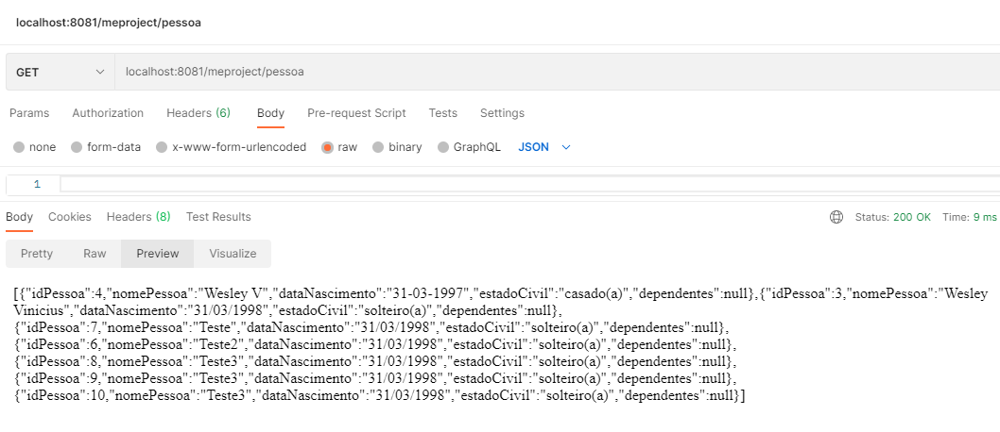
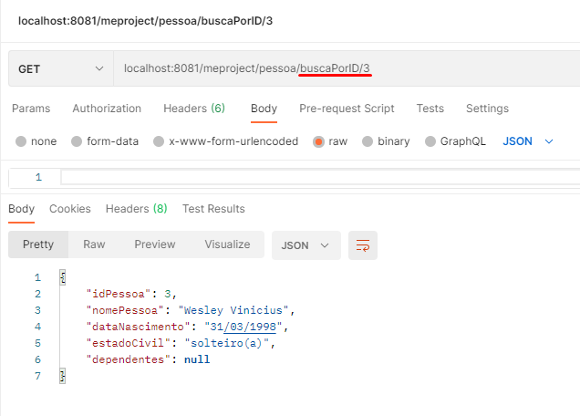
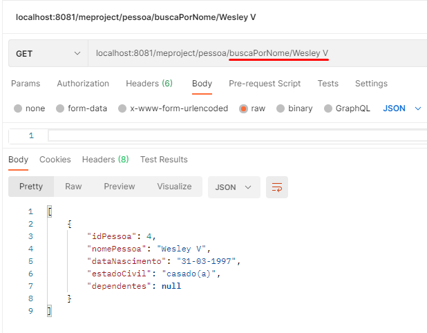
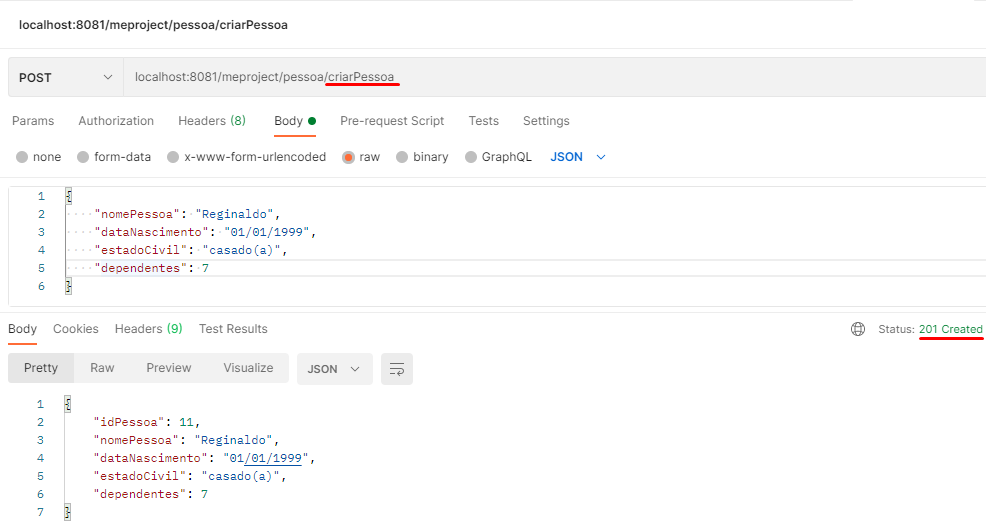
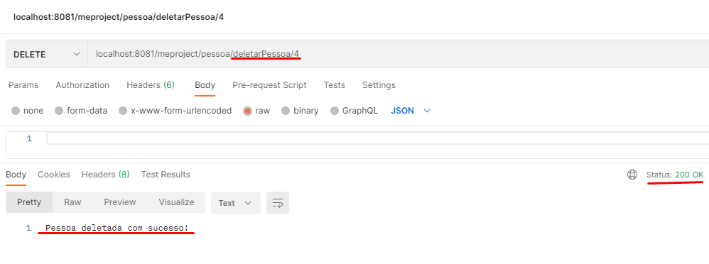
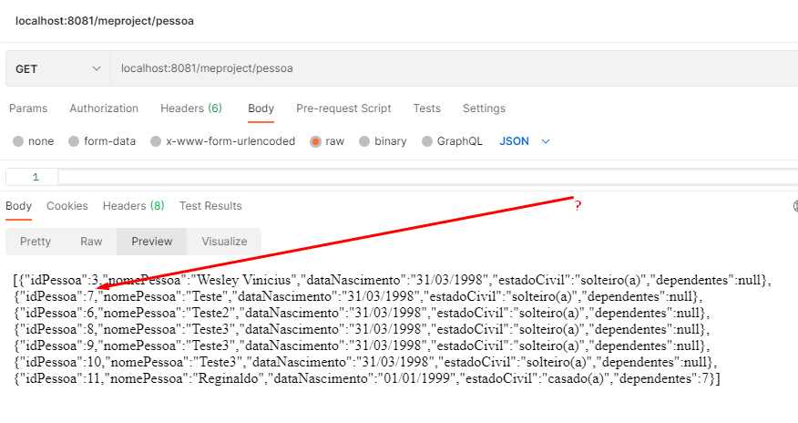
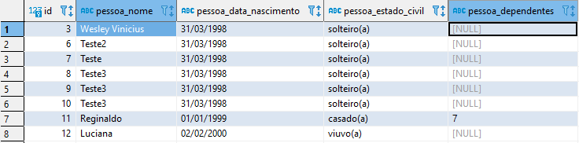

# Projeto meproject

Desenvolvido por: Wesley Vinicius (wesleyvini.social@gmail.com)
[Meu perfil no LinkedIn](https://www.linkedin.com/in/wesley-vinicius-silva-8568a516b/)

-------------
#### Tecnologias usadas:
- Java SE 11;
- Spring-boot 2.5.1;
- PostgreSQL 13.3;
- Apache Maven 3.8.1;
- Foi desenvolvido no sistema operacional Windows 10(x64).

Acessar o código:

#### Objetivo:

Criar um CRUD para um sistema de pessoas físicas utilizando Spring + PostgreSQL.

-------------
#### Esquema do banco de dados:

Column Name            | Data Type | Lenght |Not Null  |
---------------------- | --------- | ------ | -------- |
id                     | int4      |        | X        |
pessoa_nome            | varchar   | 50     | X        |
pessoa_data_nascimento | varchar   | 50     | X        |
pessoa_estado_civil    | varchar   | 60     | X        |
pessoa_dependentes     | varchar   | 100    |          |

SQL:
~~~SQL
--Antes da criação do schema, o database foi criado com o nome: "meprojectdatabase"
--Criação e seleção do schema:
create schema meproject;
SET search_path TO meproject;

SHOW search_path;

--Criação da tabela:
create table pessoa_fisica (
    id int primary key,
    pessoa_nome varchar(50) not null,
    pessoa_data_nascimento varchar(50) not null,
    pessoa_estado_civil varchar(60) not null,
    pessoa_dependentes varchar(100),
    check (pessoa_estado_civil 
    	in ('solteiro(a)',
    	'união estável',
    	'casado(a)',
    	'divorciado(a)',
    	'viuvo(a)')
    )
);
~~~
-------------

### Endpoints:

- ## /meproject/pessoa

    #### Retorna todas as pessoas existentes na tabela pessoa_fisica.

- ## /meproject/pessoa/buscaPorID/{id}

    #### Retorna a pessoa existente ao id pesquisado na tabela pessoa_fisica.

- ## /meproject/pessoa/buscaPorID/{pessoaNome}

    #### Retorna a pessoa existente ao nome pesquisado na tabela pessoa_fisica.

- ## /meproject/pessoa/criarPessoa

    #### Cria um novo registro na tabela pessoa_fisica.

- ## /meproject/pessoa/deletarPessoa/{idPessoa}

    #### Deleta uma pessoa existente na tabela pessoa_fisica pelo ID.

   #### Outra evidência do delete. A pessoa com o ID 4 foi removida.

- ## /meproject/pessoa/alterarPessoa

    #### Altera uma pessoa já existente na tabela pessoa_fisica.
    #### Caso essa pessoa não exista, o ID pode ser passado como parametro para a criação de uma pessoa nova.

- ## Banco de dados ao final da execução dos endpoints:

-------------

#### Pontos interessantes:

Eu não tinha bastante conhecimento em PostgreSQL, o projeto me forneceu um conhecimento moderado em como funciona PLSQL no PostgreSQL.
Aproveitei o projeto e me aprofundei mais em JPA/Spring.
Me desafiei a usar Maven. Estou mais familiarizado com Gradle, Maven se mostrou muito interessante e facil de utilizar.
